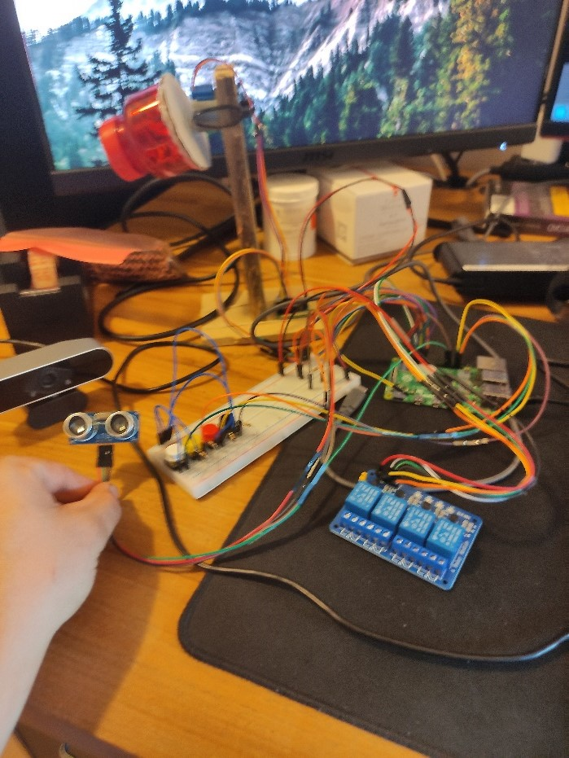
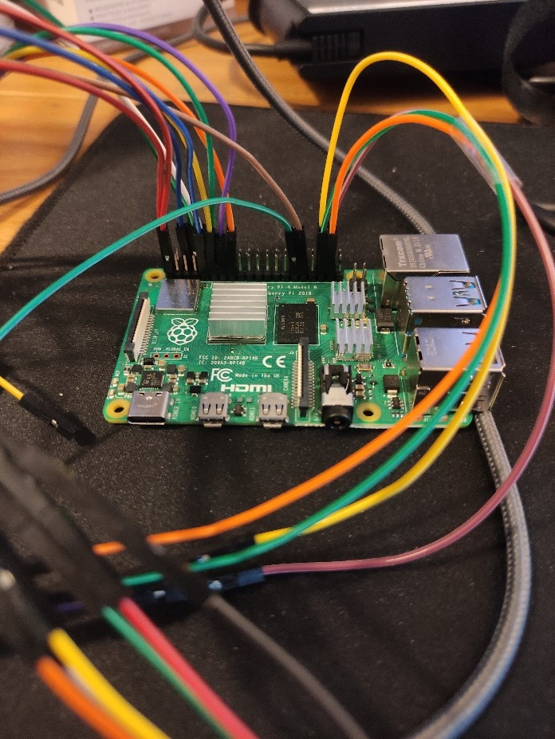
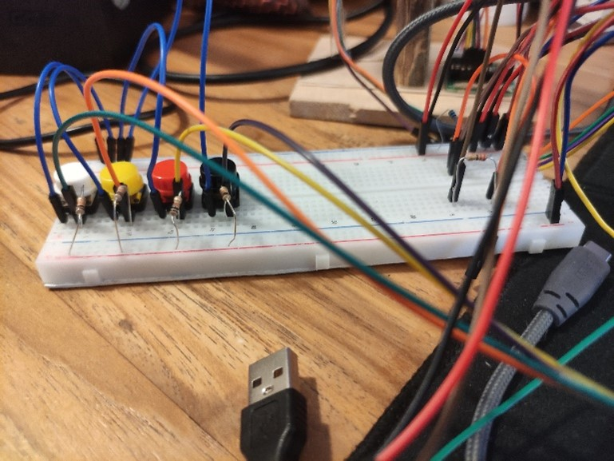
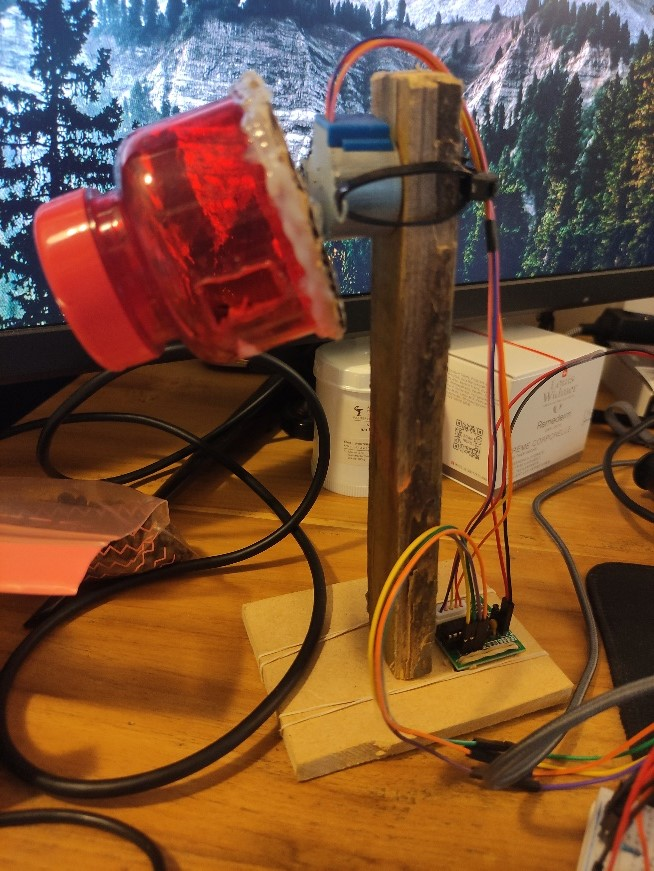

# Automatic Aquarium

In the IoT Essentials course, I embarked on the fascinating project of creating an automated aquarium that would not only monitor various data but also handle crucial tasks such as maintaining the water level and feeding the fish.

**Report:** [Automatic Aquarium report](automatic_aquarium_report.pdf)

**Video:** [YouTube](https://www.youtube.com/watch?v=dGJX4TkoIcM)

**Completed:** May 2022

## Automatic Aquarium

To automate the water level control, I devised a system based on distance measurement. By continuously measuring the distance from a fixed point to the water level, I could determine if it fell below a predefined threshold. Whenever the water level reached this critical point, a water pump connected to a relay would activate. The pump would then operate until the water was replenished to the appropriate level, at which point it would automatically turn off. For added convenience, I included buttons that allowed manual control over the pump and aquarium lights.

In addition to water level management, I implemented an automated fish feeding mechanism. Using a stepper motor, I attached a container with a dosing hole. At a pre-set time each day, the stepper motor would activate, releasing a specified amount of food into the aquarium. This ensured that the fish were fed regularly, even when I was not available to do so manually.

To enhance the monitoring capabilities of the automated aquarium, I integrated a 24/7 video surveillance system. By accessing the webcam's IP address, I could remotely view the live footage of the aquarium. This feature allowed me to keep a close eye on the fish and their environment at any time.

The Automatic Aquarium project undertaken in the IoT Essentials course aimed to create an automated system for monitoring and managing an aquarium. By incorporating distance measurement, water pumps, a stepper motor, and remote video surveillance, I successfully automated water level control, fish feeding, and monitoring. This project provided valuable hands-on experience in applying IoT principles to a real-world scenario and showcased my ability to develop innovative solutions for efficient and convenient aquarium management. Its applications extend to both personal and commercial aquarium setups, providing convenient and automated solutions for aquatic life.

